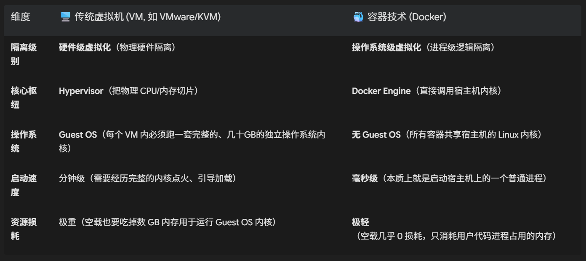

## Docker 容器化原理与镜像打包部署深度拆解

### 1. 为什么我们需要 Docker？（打破“环境地狱”的终极法宝）

在传统的软件部署中，我们经常遇到一个毁灭性的痛点——“环境地狱（Dependency Hell）”。
以你的第二个项目 GAMUT（智能农业多模态视觉质检）为例，它的物理依赖极为繁重：

操作系统：Ubuntu 22.04 LTS

显卡驱动：NVIDIA Driver 525+

CUDA 运行时：CUDA 11.8

三维点云库：Open3D (C++ 编译绑定)

深度学习框架：PyTorch 2.0 (必须与 CUDA 11.8 强绑定)

Python 依赖：FastAPI, Celery, Redis-py, NumPy 等数十个第三方包

#### ❌ 传统的物理部署（物理裸机部署）：

如果要把这套系统交付给农业厅或企业甲方的服务器，你需要登录他们的裸机，耗时 3 天去手动下载、编译、安装这些包。
更可怕的是，万一他们的服务器上原本运行着另一个需要 CUDA 12.1 的大模型服务，你的 CUDA 11.8 一旦覆盖安装，就会直接导致原先的服务崩盘。

#### 📡 Docker 的物理隔离革命：

Docker 提出了 “集装箱（Container）” 的概念。

它把你的代码、Python 解释器、Open3D 动态链接库、甚至 CUDA 运行时等所有环境，像打包行李一样，全部打包成一个只读的、标准化的文件——镜像（Image）。
在任何一台安装了 Docker 引擎的机器上，只需要执行一行 docker run，就能在一秒钟内拉起一个完全隔离、开箱即用、具有完全确定性表现的物理沙盒——容器（Container）。

### 2. ⚠️ 经典面试杀招：虚拟机（VM）与容器（Docker）的本质区别

这是 100% 的高频必考点，也是评估候选人计算机体系架构功底的分水岭。



#### 💡 形象大白话比喻：

传统虚拟机：相当于你为了让 10 个客人住，直接物理建造了 10 栋独立的别墅（Guest OS）。每栋别墅都有独立的下水道、地基、承重墙，建造成本极高，严重浪费地皮（内存）。

Docker 容器：相当于你在市中心包下了一栋大厦（宿主机），直接在里面用石膏板隔出了 10 个独立的公寓套间。大家共享大厦的下水道、电梯和承重墙（共享宿主机 OS 内核），但每个客人有自己的钥匙，在自己的房间里互不打扰。建造成本低到可以忽略不计！

### 3. 🔩 Docker 底层“三板斧”：它是如何保证安全的？

既然所有容器都共享宿主机的同一个内核，那万一容器 A 里的代码写了个死循环，或者是拿到了 root 权限，它怎么做到不把宿主机以及其他容器搞崩溃？
这全靠 Linux 内核在底层赋予 Docker 的三把物理神兵：

#### 🗡️ 神兵一：Namespaces（沙盒视界隔离——“你看不见我”）

Namespaces 是 Linux 内核的一种隔离机制，它负责给每个容器套上一个“3D 虚拟眼镜”，让容器只能看到自己的一亩三分地。

PID Namespace：进程隔离。在容器内部，你的 FastAPI 主进程 PID 是 1（以为自己是天王老子，拥有整台电脑）；但如果我们在宿主机上输入 ps -ef，会发现它的真实 PID 其实是 28345。

NET Namespace：网络隔离。每个容器都拥有独立的虚拟网卡（eth0）、IP 地址和路由表，外界无法直接访问。

MNT Namespace：文件系统隔离。容器只能看到自己镜像里的文件系统，根本看不到宿主机根目录下的物理磁盘文件。

#### 🗡️ 神兵二：Control Groups（Cgroups，物理资源卡尺——“不准多吃”）

Namespaces 解决了“看不见”的问题，但如果容器 A 的 PyTorch 推理突然开始疯抢 CPU 和显存，导致宿主机假死，该怎么办？

Cgroups 负责强行给容器套上物理卡尺。它由 Linux 内核直接驱动，可以精准限制某个容器最多只能吃宿主机的几核 CPU、多少 MB 内存：

```text
# 强行给草莓质检容器套上紧箍咒：最多只能占用宿主机的 2 核 CPU 和 4GB 内存！
docker run -d --cpus="2.0" --memory="4g" gamut-inspection-service
```

一旦容器内的 PyTorch 申请的内存超出了 Cgroups 设定的 $4\text{GB}$ 刚性红线，操作系统的 OOM Killer 会在一毫秒内毫不留情地物理杀死容器内的异常进程，从而完美保护了宿主机及其他业务的安全。

#### 🗡️ 神兵三：Overlay2（联合文件系统 UnionFS——“俄罗斯套娃”）

Docker 镜像为什么能做到“层级复用”？你下载一个 $5\text{GB}$ 的镜像，再下载一个基于同底座的镜像，为什么只需要秒级下载剩下的几百 MB？

这全靠 Overlay2 文件系统，它采用的是 Copy-on-Write（CoW，写时复制） 的物理机制：

```text
 ┌──────────────────────────────────────────────┐
 │          可读写容器层 (Container Layer)        │  <-- 用户在运行容器时创建的临时修改、日志
 ├──────────────────────────────────────────────┤
 │          只读应用层 (AxiomFin Code)          │  <-- 你的 Python 源代码
 ├──────────────────────────────────────────────┤
 │          只读依赖层 (PyTorch, Open3D)         │  <-- 庞大的第三方 C++ 依赖
 ├──────────────────────────────────────────────┤
 │          只读底层基础镜像 (CUDA/Ubuntu)        │  <-- 镜像的大理石底座
 └──────────────────────────────────────────────┘
```

工作原理：下面的几层（基础操作系统、Python依赖、代码）全部是只读的（Read-Only）。

当你在运行的容器中修改了一个文件，Docker 绝对不会物理修改只读层，而是把这个文件复制一份（Copy）到最顶部的“可读写容器层”进行修改（Write）。

物理成效：极大地节省了磁盘空间。100 个运行的容器可以共享同一个 $5\text{GB}$ 的只读底座，每个容器只占用几 KB 的顶层读写增量！


### 4. 💻 终极实战演练：为 GAMUT 深度学习应用编写多阶段构建 Dockerfile

在真实的工业界中，大模型和 3D 点云应用（包含 CUDA 和 PyTorch）由于依赖沉重，写得不好的 Dockerfile 打包出来的镜像往往高达 $12\text{GB} \sim 18\text{GB}$。这在生产环境中传输极其痛苦，甚至会导致云服务器磁盘直接爆满。


以下是为 GAMUT 编写的 工业级多阶段构建（Multi-stage Build）Dockerfile。它通过“过河拆桥”的工程化思维，将打包体积无情压缩了 60% 以上：
```text
# ==========================================
# 🛠️ 阶段一：编译与构建依赖阶段（Build Stage）
# ==========================================
# 使用 NVIDIA 官方提供的完整开发级 CUDA 镜像作为编译底座（内含 gcc, nvcc 编译工具链）
FROM nvidia/cuda:11.8.0-devel-ubuntu22.04 AS builder

# 设置环境变量，避免交互式弹窗卡死构建流程
ENV DEBIAN_FRONTEND=noninteractive

WORKDIR /build_space

# 1. 安装基础系统编译工具
RUN apt-get update && apt-get install -y --no-install-recommends \
    python3-dev \
    python3-pip \
    git \
    && rm -rf /var/lib/apt/lists/*

# 2. 将依赖清单拷贝进编译区
COPY requirements.txt .

# 3. 编译并打包 Python 依赖（--user 选项会将所有包装入 /root/.local 目录下）
# 利用清华源加速下载，并在编译完成后直接清理 pip 缓存，不留任何历史垃圾
RUN pip3 install --no-cache-dir --user -r requirements.txt -i [https://pypi.tuna.tsinghua.edu.cn/simple](https://pypi.tuna.tsinghua.edu.cn/simple)

# ==========================================
# 🚀 阶段二：生产运行阶段（Final Stage）
# ==========================================
# 丢弃阶段一中庞大的 devel 镜像和编译垃圾，改用极轻量、仅包含运行时（Runtime）的 CUDA 底座
FROM nvidia/cuda:11.8.0-runtime-ubuntu22.04

WORKDIR /app

# 1. 仅安装生产运行所必须的轻量级 Python3 运行时
RUN apt-get update && apt-get install -y --no-install-recommends \
    python3 \
    libgomp1 \
    && rm -rf /var/lib/apt/lists/*

# 2. 🌟 核心优化：过河拆桥！
# 从第一阶段的 "builder" 容器中，只把编译好的、干净的 Python 依赖包物理拷贝过来！
COPY --from=builder /root/.local /root/.local

# 将拷贝过来的局部 Python 依赖路径加入系统环境变量
ENV PATH=/root/.local/bin:$PATH
ENV PYTHONPATH=/root/.local/lib/python3.10/site-packages:$PYTHONPATH

# 3. 拷贝我们的项目核心源代码和模型权重
COPY src/ /app/src/
COPY weights/ /app/weights/

# 声明容器内部监听的端口
EXPOSE 8000

# 容器启动时的物理入口命令
ENTRYPOINT ["python3", "src/main_api.py"]
```

#### 📦 容器管家：用 docker-compose.yml 编排铁三角服务

在生产环境中，你通过以下编排配置，实现 FastAPI、Redis 与 Celery 容器的一键拉起与自动重连：

```text
version: '3.8'

services:
  # 1. 📡 Web API 网关
  gamut-api:
    build: .
    container_name: gamut_web_api
    ports:
      - "8000:8000"
    environment:
      - REDIS_URL=redis://gamut-redis:6379/0
    depends_on:
      - gamut-redis
    restart: always

  # 2. 🎛️ 内存中继仓库
  gamut-redis:
    image: redis:7.0-alpine
    container_name: gamut_redis_broker
    ports:
      - "6379:6379"
    restart: always

  # 3. 🚀 后台 GPU 算法推理车间（Celery Worker）
  gamut-worker:
    build: .
    container_name: gamut_gpu_worker
    command: celery -A src.celery_app worker --concurrency=1 --loglevel=info
    environment:
      - REDIS_URL=redis://gamut-redis:6379/0
    # 🌟 极其硬核：物理打通宿主机的显卡，让容器内的 PyTorch 能安全调用物理 GPU 算力！
    deploy:
      resources:
        reservations:
          devices:
            - driver: nvidia
              count: all
              capabilities: [gpu]
    depends_on:
      - gamut-redis
    restart: always
```

### 🎯 5. 技术面试现场：面试官的“剥皮追问”你怎么接？

#### 追问 1：你在简历里写了‘掌握 Docker 容器化部署’。既然容器共享宿主机的操作系统内核，而宿主机内核（Linux Kernel）默认是没有 NVIDIA 显卡驱动的。那么你的 PyTorch 容器底座是如何穿透隔离，直接调用宿主机物理显卡（GPU）进行点云深度学习推理的？它的底层原理是什么？

回答： “这涉及到 NVIDIA Container Toolkit（即原先的 nvidia-docker）在宿主机与容器之间的桥梁穿透机制。

默认情况下，原生的 Linux 容器由于 Mount Namespace 的文件隔离，是完全看不到宿主机 PCI 总线上的 GPU 物理硬件和动态链接库的。

当我们在 docker-compose.yml 中声明 driver: nvidia、或者在命令行中输入 --gpus all 启动容器时，底层的 NVIDIA 容器运行时（NVIDIA Container Runtime） 会在容器启动初始化（Post-start 阶段）执行两步核心动作：

物理设备映射：利用 Linux 内核的 Device Cgroup 机制，强制在容器的 /dev 目录下挂载宿主机显卡的字符设备文件，如 /dev/nvidia0、/dev/nvidia-uvm 等。

运行时动态库注入：它会强行阻断容器底部的 MNT Namespace 屏障，将宿主机上已经安装好的、与物理显卡驱动版本严格对应的用户态 CUDA 核心动态库（如 libcuda.so 驱动层链接库）以 bind-mount 的方式实时映射并注入到容器的 /usr/lib 路径中。

这样，容器内部的 PyTorch 就能像在物理裸机上一样，完美通过这些透传过去的物理驱动动态链接库直接与宿主机的显卡进行硬件底层通信，从而在完全保持容器化进程级隔离的前提下，获得了 $100\%$ 的近乎原生无损的 GPU 硬件计算加速能力。”

#### 追问 2：你的 Dockerfile 中采用了‘多阶段构建（Multi-stage Build）’。请问如果不采用多阶段构建，只是在单阶段内执行 apt-get clean 和删除临时文件，能达到同等的减重效果吗？为什么？

回答：“完全达不到，甚至可以说有着本质的物理鸿沟。

这与 Docker 底层 Overlay2 联合文件系统（UnionFS）的‘只读层级递增’物理特性 有关。
Docker 镜像是由 Dockerfile 中每一条会修改文件系统的指令（如 RUN, COPY, ADD）所生成的只读只写层层级堆叠而成的。

在一个单阶段构建中，如果我们在第一行指令中通过 apt-get install 引入了 $1\text{GB}$ 的 gcc 构建编译包，即使我们在最后一行写了 rm -rf 把它删掉，在 Overlay2 看来，这个 gcc 动态包也已经被牢牢地永久性地固化在了最底部的那个只读层里。最顶层写下的删除指令，在 UnionFS 底层其实只是给这个 gcc 文件打上了一个‘遮罩标记（Whiteout File）’，让它在容器运行时不可见，但它依然会完好无损地占用镜像的物理磁盘存储体积，导致镜像永远臃肿。

而多阶段构建（Multi-stage Build）在物理层面做到了‘彻底的物理隔离’：
它在阶段一中启动一个完整的、包含庞大编译器的容器进行依赖编译，产生二进制包；
在阶段二中，它会启动一个全新的、底盘极其干净的空白运行期基础镜像，并利用 COPY --from 将阶段一产出的、仅有几 MB 大小的二进制编译包物理拷贝过来，而阶段一中那高达数 GB 的编译器、中间缓存垃圾和系统镜像层则直接被全部抛弃。
这就像造房子时，我们在临时工棚里制造好窗户，再把窗户搬进新大楼，最后把整个工棚拆掉。这才是从根本上剔除冗余层、将镜像减重达到极限的工程化正规手段。”