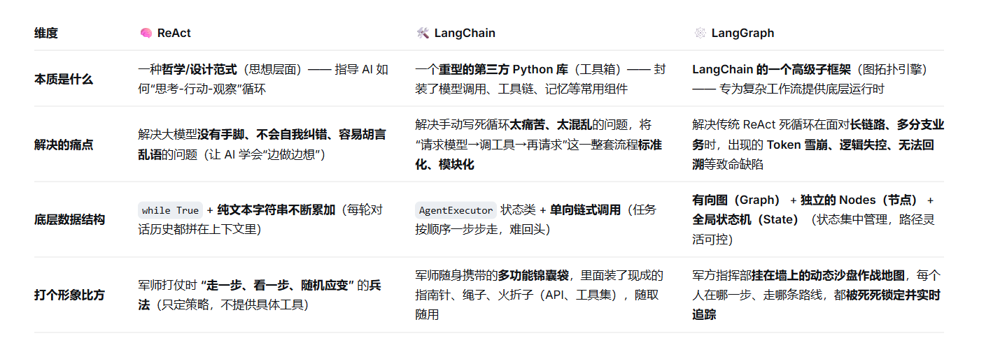

## ReAct 智能体设计范式底层死循环

### 1. 用大白话翻译这个概念

早期的 AI 比较蠢，你让它连着做几件事，它经常一脑股往前冲，想都不想。

ReAct 范式 彻底改变了这一点，它的核心公式非常简单：Thought（思考） $\rightarrow$ Action（行动） $\rightarrow$ Observation（观察）。通俗来说，就是让大模型养成“走一步、看一步、想清楚了再走下一步”的习惯。

Thought（思考）： “用户让我发一份持仓诊断邮件，我得先知道他手里有什么股票。”

Action（行动）： 调用武器 get_user_portfolio_matrix 去读账本。

Observation（观察）： 读到账本发现用户持有了“比亚迪”。

Thought（思考）： “我知道他持有比亚迪了，现在我得去查比亚迪的技术指标。”

Action（行动）： 调用技术分析工具去算 K 线。

Observation（观察）： 发现指标走坏。

Thought（思考）： “诊断结果出来了，该给他发报警邮件了。”

Action（行动）： 调用发邮件武器。

大模型在后台就是这样通过一个 while True 的死循环，不断地自我碎碎念（思考）和物理开火（行动），直到把任务彻底搞定。

为了让你看清本相，我们不聊 LangChain，直接来看你手写的原生 Python 智能体引擎伪代码：

```Python
import json

def react_agent_engine(user_prompt):
    """
    【自研原生 ReAct 智能体核心引擎】
    纯手写死循环，模拟大模型如何一边思考一边击发本地工具
    """
    # 1. 组装最核心的 ReAct 提示词，强迫大模型按照固定格式碎碎念
    system_prompt = """
    你是一个金融投研智能体。你必须严格按照以下格式进行思考和行动：
    Thought: 思考你当前需要做什么，下一步需要获取什么数据。
    Action: 决定调用的工具名，格式必须是 工具名[参数]。如果没有下一步了，请输出 最终答案[结果]。
    Observation: 物理工具执行后返回的真实结果（这一步由系统输入，你不用自己生成）。
    """
    
    current_context = system_prompt + f"\nUser Question: {user_prompt}"
    max_steps = 5  # 防御性编程：防止大模型死循环把 Token 烧光
    
    for step in range(max_steps):
        print(f"\n🔄 [智能体心跳机制] 当前正在执行第 {step+1} 轮思考...")
        
        # 2. 物理请求大模型 API（此处模拟大模型吐出的文本响应）
        llm_response = mock_llm_api_call(current_context, step)
        print(llm_response)
        
        # 将大模型的思考和行动记录到上下文中，维持“记忆”
        current_context += f"\n{llm_response}"
        
        # 3. 解析暗号：检查大模型是要物理开火（Action）还是已经拿到答案（最终答案）
        if "最终答案[" in llm_response:
            final_result = llm_response.split("最终答案[")[1].split("]")[0]
            print(f"🎉 [任务圆满结束] 智能体找到最终答案: {final_result}")
            return final_result
            
        if "Action:" in llm_response:
            # 提取工具名和参数，例如：get_stock_price[002594]
            action_str = llm_response.split("Action:")[1].strip()
            tool_name = action_str.split("[")[0]
            tool_param = action_str.split("[")[1].split("]")[0]
            
            print(f"🚀 [物理武器击发] 大脑思考完毕，决定调用函数: {tool_name}, 参数: {tool_param}")
            
            # 4. 反射路由：物理调用本地 core_tools.py 里的武器
            if tool_name == "get_stock_price":
                # 假设去通达信查到了比亚迪是 250.0 元
                observation = "{\"price\": 250.0, \"status\": \"OK\"}" 
            elif tool_name == "get_user_portfolio_matrix":
                observation = "{\"holdings\": [\"比亚迪\"], \"cash\": 10000}"
            else:
                observation = "错误：未知工具"
                
            print(f"👁️ [Observation 观测流返回] 物理世界真实数字流入大模型: {observation}")
            
            # 5. 把物理世界的真实观测结果灌回上下文，逼迫大模型基于这个新数字写下一轮的 Thought
            current_context += f"\nObservation: {observation}"

# 模拟大模型在不同阶段的吐字反应
def mock_llm_api_call(context, step):
    if step == 0:
        return "Thought: 用户想发持仓诊断。我需要先查他的资产账本，看看持有什么股票。\nAction: get_user_portfolio_matrix[]"
    elif step == 1:
        return "Thought: 观测结果显示用户持有比亚迪。现在我需要调取通达信实时因子查一下比亚迪价格。\nAction: get_stock_price[002594]"
    else:
        return "Thought: 比亚迪目前价格稳定，账户健康，我可以得出结论了。\n最终答案[账户诊断完毕：持有比亚迪，现价250元，技术形态良好，无需清仓。]"

# 点火运行
react_agent_engine("帮我诊断一下我的持仓情况")
```

### 2. 真实研发痛点：为什么要用 LangGraph 拓扑状态机？

你看上面的原生 ReAct 范式，它是通过一整个大字符串（Context）不断累加来维持记忆的。
这就产生了一个严重的工业界落地痛点：

- 上下文风暴（Token Explosion）：如果后台死循环跑了 4、5 圈，由于每次工具返回的 JSON 数据（Observation）都很长，整个提示词会像滚雪球一样越来越大。大模型很快就会记性疲劳、开始胡言乱语（幻觉），甚至直接触发 Token 长度越界报错。

你在项目一里改进写了 LangGraph 设计模式，就是为了解决这个痛点：

LangGraph 的解决思路：它不再用一个无休止累加的大字符串做记忆。它把整个过程拆成一张“有向图（Graph）”。每个工具是一个独立的节点（Node），数据存在一个干净的、结构化的全局状态机（State）里。

跑完一个工具，清空不必要的脏文本，只把核心的 price 或 holdings 数字塞进状态机，完美控制了 Token 的长度。

### 3. React和langchain以及langgraph的联系和区别是什么？

用一句话最通俗的打个比方：

ReAct 是大模型的一套“思维训练方法（一种思想）”。

LangChain 是为了实现这种思想而诞生的“多功能工具箱（全家桶库）”。

LangGraph 是当工具箱不够用时，专门为了把复杂思想做成大厂级稳定产线而升级的“高阶图拓扑框架”。

#### 🗺️ 一图看懂三者的演进与底层管道


#### 演进关系（为什么会有这三者）

ReAct 是“思想萌芽” —— 它提出了“推理+行动”的闭环，但实现上只是简单的 while 循环，把所有对话历史塞进上下文，笨重且不可控。

LangChain 是“工具化落地” —— 它将 ReAct 思想包装成了可直接调用的 Agent 类，提供了标准化接口、记忆组件和工具链，大幅降低开发门槛，但本质上仍是线性流水线，复杂场景下力不从心。

LangGraph 是“架构升级” —— 它把工作流抽象成图结构，允许分支、循环、并行，并维护全局状态机，从而支持长时任务、断点续跑、人工介入等高阶需求，是 LangChain 应对企业级复杂 Agent 的终极方案。

#### 🔄 深度拆解：它们在AxiomFin 项目里是怎么发生关系的？

在面试时，最怕空谈理论。必须把这三个词放进你亲手写的 AxiomFin（金融投研中台） 业务里去自圆其说：

##### 1. 思想层：用了 ReAct 范式
用户问系统：“帮我看看手里的股票，要是坏了就发邮件叫我。”

系统必须先查持仓（Action 1） $\rightarrow$ 拿到比亚迪（Observation 1） $\rightarrow$ 算比亚迪 K 线指标（Action 2） $\rightarrow$ 发现 MACD 死叉（Observation 2） $\rightarrow$ 最终触发发信。

这种“走一步看一步、用上一步的结果驱动下一步”的串联逻辑，就是你给大模型注入的 ReAct 兵法思想

##### 2. 工具层：用了 LangChain 包

大模型（大脑）想查通达信或者发邮件，但它自己写不出 Python 代码。

用了 LangChain 里的 @tool 装饰器，把 get_stock_price、send_email_report 物理函数打包绑定。

LangChain 帮你把这些 Python 函数自动翻译成了大模型能看懂的标准 JSON 说明书。LangChain 在这里扮演了“翻译官和工具箱”。

##### 3. 架构层：升级用了 LangGraph 设计模式（🌟 核心亮点）

传统 LangChain 的做法： 所有的思考、行动、工具返回结果，全部一股脑用 \n 换行符强行粘在一个巨大的字符串后面，拼命喂给大模型。

致命大水坑： 只要工具一多、或者后台轮询跑久了，这个字符串就会长到爆炸（Token 风暴）。大模型后面直接“记性疲劳、开始幻觉”，甚至数字全部看错。

用 LangGraph 的改进做法：

把“选股”、“技术面分析（signal_analyzer）”、“持仓诊断（portfolio_monitor）”拆成了图上的三个独立节点（Nodes）。

工具查出来的股票代码和现价，不再往大模型的 Prompt 里面疯狂叠加。而是物理抽离出来，整整齐齐地写进一个名叫 State 的全局 Python 字典里。

每个节点只从 State 里拿自己需要的数字（如现价、成本），干完活把结果更新回 State。大模型的 Prompt 永远保持干净、短小！

### 🎯 本考点通关：面试官的“架构师视角”追问你怎么接？

#### 面试官：我看你简历里写了 LangChain 和 LangGraph，它们俩到底有什么区别？你为什么不直接用 LangChain 的 AgentExecutor，而是要引入 LangGraph？

回答： “LangChain 的传统 AgentExecutor 底层是一个链式的、依赖纯文本上下文累加的单向死循环。在金融多因子审计或长链路持仓诊断场景下，高频的工具调用（Observation 注入）会导致 Prompt 长度雪崩式增长，引发大模型的‘长上下文注意力衰减’，甚至数字幻觉。

而 LangGraph 引入了‘图结构’与‘集中式状态机（State Management）’。它将不同的业务（如选股、K线指标计算、邮件网关）解耦为图的有向节点，各个节点之间不通过文本上下文传递数据，而是通过统一的全局状态（State）进行状态捕获与增量更新。这不仅将大模型每轮推理的 Token 消耗控制在极低的刚性区间，还彻底杜绝了状态丢失与踩踏，更适合工业级多 Agent 协同的稳定性落地。”

#### 面试官：你在简历里写熟练 ReAct 范式，请问 ReAct 解决的核心痛点是什么？它的底层数据流是怎么闭环的？

回答： “传统的大模型属于单向生成模型，在面对复杂或需要外部动态数据的任务时，容易因缺乏事实依据而产生幻觉。ReAct 范式通过将推理（Thought）与行动（Action）进行交替式闭环解耦。大模型在每一步生成中，首先通过 Thought 写出当前思考，再通过 Action 吐出特定的工具调用暗号；后端拦截该暗号、物理执行本地工具，并将真实世界的 Observation 观测结果拼回大模型的上下文。通过这个 Thought -> Action -> Observation 的常驻死循环，让模型实现了‘走一步、看一步’的动态纠错与实时外挂数据交互能力。”

#### 面试官：既然 ReAct 这么好，那你在工程落地中发现它有什么缺陷？你又是怎么优化调优的？

回答： “ReAct 的原生缺陷在于对长上下文的依赖性过高。由于 Observation 返回的结构化数据会高频追加到 Prompt 尾部，容易导致 Token 消耗呈雪崩式爆发，并引发大模型对前期 Prompt 的注意力衰减。为了解决这一痛点，我在 AxiomFin 中参考了 LangGraph 的状态管理模式，引入了结构化的全局状态机（State Checkpoint），将‘工具执行的上下文’与‘模型的思考路径’进行逻辑剥离，每一轮节点交互后只向 State 增量同步核心财务因子，彻底避免了 Token 堆积与状态丢失。”