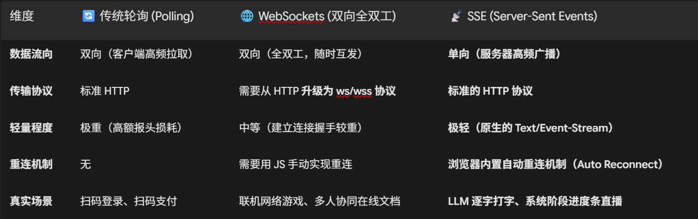
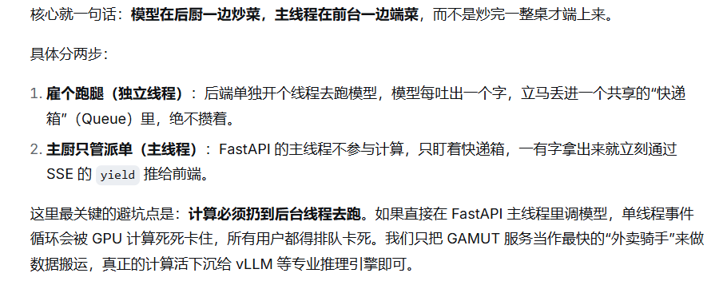

## SSE（Server-Sent Events）流式传输与高并发交互

### 1. 为什么传统的 HTTP 连接无法做“实时直播”？

在传统的 HTTP 协议中，请求采用的是 “请求-响应” 一对一模型。浏览器不主动敲门，服务器就绝对不能说话。

在 3D 点云深度学习推理（项目二）或大模型生成（项目一）这种重型任务中，后台计算可能长达 $3 \sim 8$ 秒。

如果我们采用传统的 HTTP 或轮询方案，会面临以下致命死穴：

#### ❌ 方案 A：传统 HTTP 同步等待（卡死转圈）

前端发起 POST 请求，后端开始算点云、跑大模型。在 5 秒钟内，HTTP 连接一直保持静默。

死穴：前端界面完全卡死，用户无法进行任何操作。万一遇到网络波动，极易触发 Gateway Timeout (504) 网关超时报错。

#### ❌ 方案 B：传统短轮询（Short Polling）

前端每隔 1 秒，主动发一个 GET /get_status 请求去问：“算完了吗？”

死穴：如果并发用户量上升到 1000 人，服务器每秒会平白无故承受 1000 次无意义的 HTTP 请求冲击。这不仅在严重浪费带宽和连接池资源，还会把自己直接 DDoS 挂掉。

### 2. 三大流式传输方案的底层物理对比

为了实现流畅的“实时直播效果”，行业里演化出了三种不同的通信方案。在面试时必须要能清晰说明它们的边界：


#### 💡 你的架构决策：为什么 GAMUT 质检流水线必选 SSE？

天然单向性：在草莓质检中，客户端（前端大屏）只需要充当“监视器”，实时看后台的推理阶段。数据流是 100% 纯单向的（后端发送 $\rightarrow$ 前端接收），完全没必要上重型的 WebSockets 去处理复杂的双向握手。

零协议转换成本：由于 SSE 就是普通的 HTTP，它能完美穿透各种防火墙，100% 免疫大部分公司局域网对 WebSockets（ws 端口）的物理安全屏蔽。

### 3. SSE 的网络底层：长什么样？

在 HTTP 层面，SSE 是怎么告诉浏览器“不要关闭连接，继续听我说”的？
它的核心在于后端响应包里携带的三个特殊的 HTTP 发信头（Headers）：
```text
HTTP/1.1 200 OK
Content-Type: text/event-stream     <-- 🌟 核心：告诉浏览器，这是一个持续不间断的事件流
Cache-Control: no-cache             <-- 🌟 核心：禁止中间代理缓存数据，必须实时传输
Connection: keep-alive              <-- 🌟 核心：保持长连接，不要关闭管道
X-Accel-Buffering: no               <-- 🌟 核心：严禁 Nginx 等网关拦截和缓存
```
数据流传输时，每一条广播报文都必须严格遵循以下纯文本格式：
```text
event: stage_update             <-- 事件类型
data: {"stage": "点云下采样", "progress": 20}   <-- 传输的 JSON 数据（必须是单行）

event: stage_update
data: {"stage": "DGCNN模型推理", "progress": 60}
```

### 4. 核心对比代码：用 FastAPI 手写一个 SSE 广播网关

我们在 GAMUT 中用 Python FastAPI 实现的“流式状态网关”，其底层核心逻辑如下：

```python
import asyncio
from fastapi import FastAPI
from fastapi.responses import StreamingResponse

app = FastAPI()

# ==========================================
# 🛰️ 异步生成器：模拟 3D 点云质检产线的流式状态
# ==========================================
async def fruit_inspection_event_generator():
    """
    【异步状态数据发射舱】
    通过 async-yield 异步迭代器，高频向前端广播计算进度，实现“零阻塞”高并发。
    """
    try:
        # 阶段 1：点云预处理
        await asyncio.sleep(0.5) # 模拟硬件读取耗时
        yield "event: stage_update\ndata: {\"stage\": \"点云滤波中...\", \"progress\": 25}\n\n"
        
        # 阶段 2：3D 特征提取
        await asyncio.sleep(1.2) # 模拟 GPU 异构推理耗时
        yield "event: stage_update\ndata: {\"stage\": \"DGCNN 几何特征提取中...\", \"progress\": 60}\n\n"
        
        # 阶段 3：大模型刚控决策
        await asyncio.sleep(0.8) # 模拟 LLM 逻辑判断耗时
        yield "event: stage_update\ndata: {\"stage\": \"LLM 决策完成：判定为一级果！\", \"progress\": 95}\n\n"
        
        # 最终指令下发
        yield "event: cmd_execute\ndata: {\"action\": \"PASS\", \"progress\": 100}\n\n"
        
    except asyncio.CancelledListener:
        # 🩺 自愈机制：万一前端浏览器关闭了网页，后端能立刻捕捉到“长连接断开”，停止 GPU 浪费，优雅释放！
        print("🔌 [连接断开] 检测到前端大屏主动断开连接，正在优雅释放后台推理任务。")

# ==========================================
# 📡 物理流式端点（SSE Entry Point）
# ==========================================
@app.get("/api/v1/quality_inspection/stream")
async def stream_quality_inspection():
    """
    【高并发 SSE 直播网关】
    利用 StreamingResponse 将生成器绑定至 HTTP 长连接。
    """
    # 物理返回 text/event-stream 协议，让浏览器开启持续监听状态
    return StreamingResponse(
        fruit_inspection_event_generator(),
        media_type="text/event-stream",
        headers={
            "Cache-Control": "no-cache",
            "Connection": "keep-alive",
            "X-Accel-Buffering": "no" # 强行熔断 Nginx 缓存，实现真正的 0 延迟
        }
    )
```
### 5. 🛠️ 工业级踩坑：被 Nginx 拦截流式输出的“致命惨剧”

在实际的线上生产环境中，你几乎 $100\%$ 会把后端挂在 Nginx 后面做反向代理。
这时候，如果你直接发布系统，就会发生一个致命的 Bug：

现象：前端大屏完全不显示打字机或者进度条效果。页面原地干等了 3 秒钟，最后突然“啪”地一下把所有步骤（预处理、推理、决策）在同一毫秒内全部喷了出来！流式交互彻底沦为摆设。

#### 🔍 事故排查与归因分析：

这是因为 Nginx 默认开启了“响应缓冲区（Proxy Buffering）”。
Nginx 以为你的后端是一个普通的 Web 网页，为了节省网络 I/O 损耗，它会把你的后端 yield 出来的数据先屯在自己的内存里。直到攒够了一定大小（比如 4KB）或者等到长连接彻底断开时，才一次性发给浏览器。

#### 🩺 彻底解决办法：

你在代码中通过注入 X-Accel-Buffering: no 这一行 HTTP 头，完美攻克了这个暗伤：

当 Nginx 看到响应头里有 X-Accel-Buffering: no 时，它会瞬间明白：“这个数据必须走实时绿色通道，不准存在缓冲区里，有多少给我立刻往用户终端扔多少！”

成功恢复秒级丝滑进度条直播，这就是扎实的网络层优化经验。

### 🎯 6. 技术面试现场：面试官的“剥皮追问”你怎么接？

#### 追问 1：既然 WebSockets 可以实现双向通信，功能更强大，为什么你不在你的质检决策服务（GAMUT）里直接使用 WebSockets，而是选了 SSE？

在草莓异构视觉质检场景中，数据流是极其纯粹的、单向的‘从服务端到监控端’的状态推送。在这种场景下，使用 WebSockets 属于过度设计（Over-engineering）。
WebSockets 需要在应用层从标准的 HTTP 协议强制升级到 ws/wss 协议，在经过微服务网关或复杂的 Nginx/K8s Ingress 路由时，需要额外配置大量的 Sticky Sessions（粘性会话）和连接超时治理。

相比之下，SSE 是标准的 HTTP 长连接协议，完全兼容现有的 HTTP 基础设施（如防火墙、负载均衡、反向代理），协议开销极低。此外，SSE 拥有浏览器原生内置的 Automatic Reconnection（自动断线重连）与 Event ID 状态丢失自愈能力，而 WebSockets 必须在客户端手动用 JS 编写繁琐的重连心跳检测。因此，选用 SSE 是保证高并发下产线大屏流畅渲染的最优工程选择。”

#### 追问 2：你的 StreamingResponse 里面用了 async def。那如果你的生成器里面有阻塞性的 CPU 密集型计算（比如跑 PyTorch 深度学习推理），你是怎么防止它把 FastAPI 的单线程事件循环（Event Loop）卡死的？

FastAPI 基于 Python 的 asyncio 单线程事件循环运行。如果我们在一个 async def 的生成器内部直接运行阻塞性的、CPU 密集型深度学习推理（如 Open3D 点云下采样、PyTorch 矩阵计算），它会死死霸占当前事件循环，导致其他用户的 HTTP 请求全部排队卡死。

为了解决这个致命缺陷，我在 GAMUT 架构设计中做了 ‘推理解耦’：

前端发起的 GPU 质检推理请求，绝对不会在 FastAPI 的主线程里物理执行。而是通过 Celery 异步任务队列将 3D 点云推理和 LLM 决策任务派发给后台独立的 Celery Worker 进行多进程计算。
我们在 FastAPI 的 SSE 生成器中，仅仅是用 asyncio.sleep() 配合非阻塞的管道去监听 Redis 或 Celery 返回的任务状态。这样，FastAPI 线程只做轻量级的 I/O 状态转发，从而释放了单线程的并发瓶颈，保证了高并发访问下的系统响应速度。”

#### 追问 3：大模型的流式打字效果（Tokens Streaming）底层是怎么实现的？你在 GAMUT 中如果用到了 LLM 决策，如何把它的“字”通过你的 SSE 管道推出去？

核心机制是“异步解耦 + 逐字转发”：

推理层解耦：HuggingFace 的 TextIteratorStreamer 在独立线程中跑模型推理，每生成一个 Token 就塞入线程安全的阻塞队列（Queue），主线程绝不等待 generate() 结束。

Web层非阻塞转发：FastAPI 主线程通过 run_in_executor 异步监听该队列，一旦拿到 Token 就立即通过 yield 封装成 SSE 的 data 字段推给前端，整个过程零阻塞。

生产优化：真正的计算密集型推理下沉至 vLLM 等专用框架，利用 Continuous Batching 合并多用户请求，GAMUT 服务仅充当 I/O 搬运层，维持轻量级的长连接状态管理即可。



#### 终结追问（补刀）：如果同时有 100 个用户问大模型，你的线程池扛不住怎么办？

回答：用“混合隔离调度”策略：

实时交互式流式（Interactive Streaming）：只负责传递 Token，真正的推理计算我全量卸载给了 vLLM 或 TensorRT-LLM 这类高性能推理框架。它们自带 Continuous Batching（连续批处理） 机制，能动态合并多个用户的请求一起过 GPU，利用率极高。

GAMUT 主服务只做“搬运工”：它绝不碰模型权重，仅仅是从 vLLM 的 Socket 或 Redis Stream 中订阅 Token，然后透传给前端的 SSE 长连接。因此，即使并发上千，GAMUT 主服务的压力也仅仅在于维持 HTTP 长连接的内存开销，而计算层完全被 vLLM 的 PagedAttention 高效管理。

