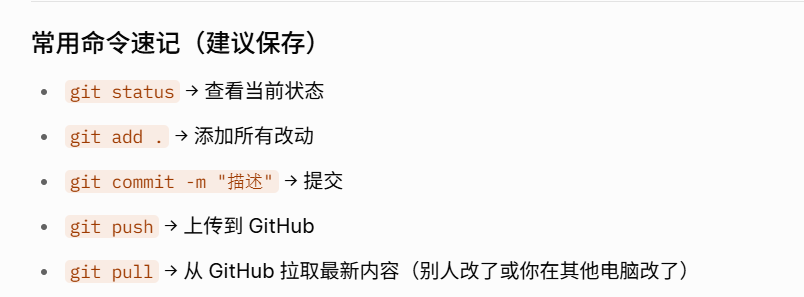

# 2026-05-15:
测试使用vscode连接github仓库，创建自己的第一个项目。

如何上传本地改动到 GitHub（标准工作流程）：
以后每次修改代码后，都按下面三步走：
PowerShell# 1. 查看修改了哪些文件
git status

# 2. 添加所有修改（或指定文件）
git add .

# 3. 提交修改（必须写提交信息）
git commit -m "这里写这次修改的内容，比如：添加了Python基础笔记"

# 4. 上传到 GitHub
git push
