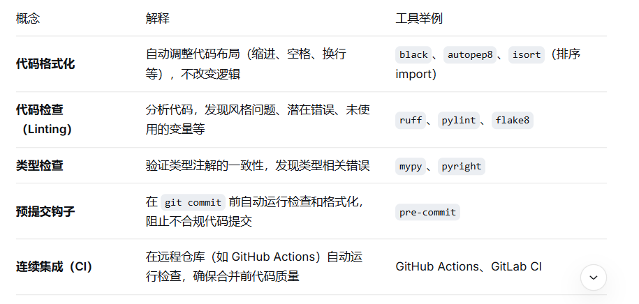

代码格式与检查是工程化的“质检流水线”。没有它，代码会随着团队协作变得风格各异、难以阅读，甚至藏着潜在的 bug。

# 一、核心概念：代码格式与检查是什么？



需要的工具链（现代 Python 标配）

ruff：极快的 linter + 格式化器（替代 flake8、isort、autoflake 等多个工具）；

mypy：静态类型检查；

pre-commit：管理 git 钩子，提交前运行上述工具   pre-commit run --all-files；

当前趋势：ruff 正在成为一体化的工具，同时替代 flake8、isort、autoflake、甚至部分 black 的功能。推荐新项目直接用 ruff。

# 二、实际操作

## 技能1：安装和运行 ruff（一体化工具）

安装：

pip install ruff

检查代码（lint）：

ruff check .           # 检查当前目录所有 Python 文件

ruff check --fix .     # 自动修复可修复的问题（如删除未使用的 import）

格式化代码：

ruff format .          # 格式化所有文件（类似 black）

配置文件（pyproject.toml 中）：

```python
[tool.ruff]
line-length = 88
target-version = "py310"

[tool.ruff.lint]
select = ["E", "F", "I", "UP"]  # 选择哪些规则集
ignore = ["E501"]               # 忽略特定规则（如行太长）

[tool.ruff.format]
quote-style = "double"
indent-style = "space"
```

常用规则集：

E / W：pycodestyle 风格错误

F：pyflakes 逻辑错误（未使用变量等）

I：import 排序

UP：pyupgrade 语法升级建议

C：复杂度检查

B：bug 检测

## 技能2：使用 pre-commit 自动化检查

安装 pre-commit：

pip install pre-commit

创建 .pre-commit-config.yaml（在项目根目录）：

```yaml
repos:
  - repo: https://github.com/astral-sh/ruff-pre-commit
    rev: v0.4.0
    hooks:
      - id: ruff
        args: [--fix, --exit-non-zero-on-fix]
      - id: ruff-format

  - repo: https://github.com/pre-commit/pre-commit-hooks
    rev: v4.5.0
    hooks:
      - id: trailing-whitespace
      - id: end-of-file-fixer
      - id: check-yaml
      - id: check-added-large-files

  - repo: https://github.com/pre-commit/mirrors-mypy
    rev: v1.8.0
    hooks:
      - id: mypy
        additional_dependencies: [types-all]
```

安装 git 钩子：

pre-commit install

效果：每次 git commit 时，自动运行 ruff 检查和格式化，如果有问题则阻止提交并显示错误。

手动运行所有检查：

pre-commit run --all-files

AI 提示词：
“生成一个 pre-commit 配置，包含 ruff（检查和格式化）、trailing-whitespace 和 mypy”


## 技能3：使用 mypy 进行类型检查

安装：

pip install mypy

运行：
mypy src/ --ignore-missing-imports

配置 pyproject.toml：
```yaml
[tool.mypy]
python_version = "3.10"
ignore_missing_imports = true
warn_return_any = true
warn_unused_configs = true
disallow_untyped_defs = false   # 初期可设为 false，逐步严格
```

示例：为函数添加类型注解，mypy 会验证调用处。
```python
def greet(name: str) -> str:
    return f"Hello, {name}"

greet(123)   # mypy 会报错：Argument 1 to "greet" has incompatible type "int"; expected "str"
```
为什么需要类型检查？

提前发现类型错误（避免运行时崩溃）

作为文档，明确函数期望的输入输出

IDE 提供更好的自动补全

AI 提示词：

“为下面的 Python 函数添加类型注解，并配置 mypy 检查：def process_data(data, threshold=0.5): return data > threshold”