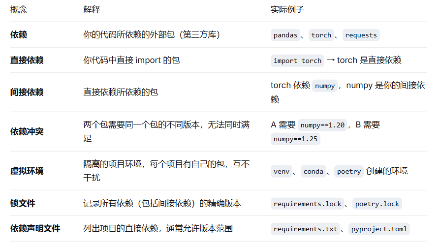
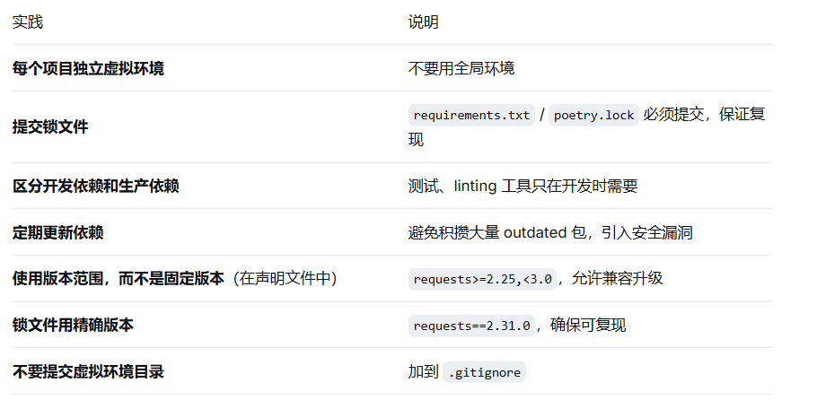
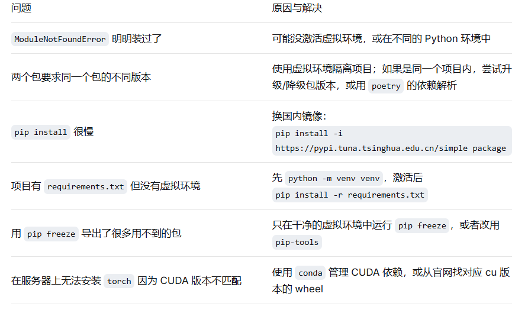

依赖管理是工程化的“供应链系统”。没有它，你的代码可能在同事电脑上跑不起来，或者三个月后你自己也跑不起来。

# 一、核心概念：什么是依赖管理？



# 二、实际操作：必须掌握的 5 个技能

## 技能1：创建和使用虚拟环境（venv）

创建虚拟环境（在项目根目录）：
```
python -m venv venv
```
第一个 venv 是 Python 的虚拟环境模块

第二个 venv 是创建的目录名（通常叫 venv 或 .venv）

激活虚拟环境：
```python
Windows：venv\Scripts\activate

Mac/Linux：source venv/bin/activate
```
验证：命令提示符前出现 (venv) 表示激活成功。

退出虚拟环境：deactivate

删除虚拟环境：直接删除 venv/ 目录。

原则：

每个项目有自己独立的虚拟环境

venv/ 目录加入 .gitignore（不提交到 Git）

只提交依赖声明文件（requirements.txt 等）


## 技能2：生成和使用 requirements.txt
生成（在激活的虚拟环境里）：
```python
pip freeze > requirements.txt
```
这会记录当前环境中所有包（包括间接依赖）的精确版本。

典型的 requirements.txt 内容：
```text
torch==2.1.0
pandas==2.0.3
numpy==1.24.3
requests==2.31.0
pytest==7.4.0
```
安装依赖（在新环境）：
```python
pip install -r requirements.txt
```
问题：pip freeze 会导出所有包，包括间接依赖。这有两个缺点：

很难看出哪些是直接依赖（你应该声明的）

升级依赖时很麻烦

改进方案：使用两个文件

requirements.in（或 requirements/base.txt）：只写直接依赖，允许版本范围（torch>=2.0）

requirements.txt：通过工具（如 pip-tools）从 requirements.in 编译生成精确版本的锁文件

## 技能3：使用 pip-tools 管理依赖（推荐）

安装 pip-tools：
```python
pip install pip-tools
```
创建 requirements.in：
```text
torch>=2.0,<2.2
pandas>=2.0
requests
pytest
```
编译生成精确版本锁文件：
```python
pip-compile requirements.in
```
会生成 requirements.txt，包含所有依赖的精确版本。

同步安装：
```python
pip-sync requirements.txt
```
这会安装精确版本，并卸载环境中多余的包。

升级依赖：
```python
pip-compile --upgrade-package torch requirements.in
```

工作流：

手动编辑 requirements.in

运行 pip-compile requirements.in 生成 requirements.txt

运行 pip-sync requirements.txt 同步环境

提交 requirements.in 和 requirements.txt 到 Git

## 技能4：使用 poetry（现代一站式工具）

安装 poetry：
```python
pip install poetry

#或者官方安装脚本
curl -sSL https://install.python-poetry.org | python3 -

初始化新项目：
poetry new myproject
cd myproject

或导入现有项目：
cd existing_project
poetry init

添加依赖：
poetry add torch pandas requests
poetry add --dev pytest black    # 开发依赖

#poetry 自动维护两个文件：
#pyproject.toml：声明直接依赖（版本范围）
#poetry.lock：锁文件，精确版本

安装所有依赖：
poetry install
这会创建虚拟环境（默认在 ~/Library/Caches/pypoetry），并从 lock 文件安装。

在虚拟环境中运行命令：
poetry run python main.py

激活 poetry 虚拟环境（方便调试）：
poetry shell

更新依赖：
poetry update torch

导出 requirements.txt（用于 Docker 等）：
poetry export -f requirements.txt --output requirements.txt
```
优点：
自动管理虚拟环境
避免手动维护两个文件
锁定精确版本，确保可复现
支持依赖分组（dev, test, docs）

## 技能5：使用 conda（适用于 AI 项目的特殊需求）

何时需要 conda：

需要非 Python 的 C/C++ 库（如 CUDA、OpenCV、FFmpeg）;

项目依赖不在 PyPI 上（某些深度学习库）;

团队成员更习惯 conda 生态;

基本用法：
```python
#创建环境
conda create -n myenv python=3.10

#激活
conda activate myenv

#安装包
conda install pytorch torchvision pytorch-cuda=12.1 -c pytorch -c nvidia
pip install transformers   # 混合使用 pip 也可以

导出环境：
conda env export > environment.yaml

从环境文件创建：
conda env create -f environment.yaml
```
注意：environment.yaml 通常包含平台特定信息，不如 requirements.txt 可移植。

# 三、依赖管理最佳实践



# 四、常见问题与解决



