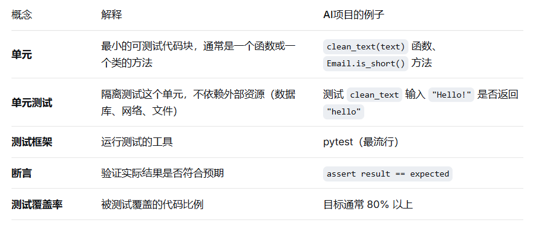
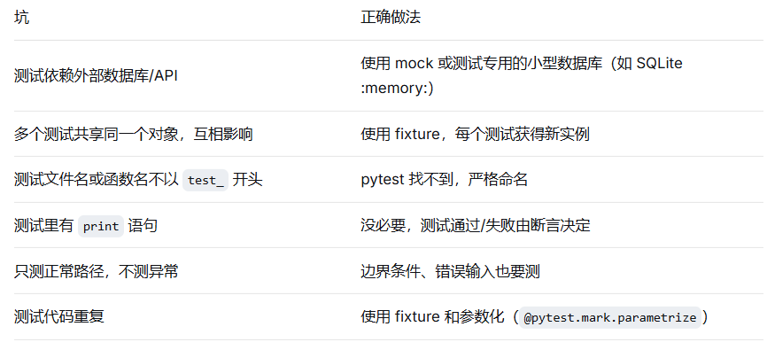

单元测试是工程化的“安全网”。没有测试的代码，改一行可能崩三处；有测试的代码，改完跑一遍测试就能安心提交。

# 一、核心概念：什么是单元测试？



为什么需要单元测试？

防止回归：改了一个函数，不会无意中破坏其他功能。

文档作用：看测试就知道这个函数应该怎么用、期望什么输出。

重构信心：大改代码后，测试通过就说明核心行为没变。

节省手工测试时间：自动运行，几秒钟验证所有功能。

# 二、pytest 基础概念

1. 测试文件命名

必须以 test_ 开头或以 _test.py 结尾

例如：test_text_clean.py、test_models.py

1. 测试函数命名

必须以 test_ 开头

例如：test_clean_text_removes_punctuation()

1. 断言（断言失败则测试失败）

assert 实际结果 == 预期的标准

4. 测试用例结构（AAA 模式）
```python
def test_something():
    # Arrange（准备数据）
    input_text = "Hello, World!"
    expected = "hello world"
    
    # Act（调用被测函数）
    result = clean_text(input_text)
    
    # Assert（断言）
    assert result == expected
```

5. 运行测试

```python

pytest                    # 运行所有测试

pytest tests/test_utils.py  # 运行单个文件

pytest -k "clean"         # 运行名字包含 clean 的测试

pytest -v                 # 显示详细信息

```

# 三、测试覆盖率（coverage）

安装：
```python
pip install pytest-cov
```
运行并查看覆盖率：
```python
pytest --cov=utils --cov=models --cov=services tests/
```
输出示例：
```python
text
Name                     Stmts   Miss  Cover
--------------------------------------------
utils/config_loader.py      12      0   100%
utils/logger.py             20      2    90%
models/email.py             15      1    93%
--------------------------------------------
TOTAL                       47      3    94%
```

目标：核心业务逻辑（models, services）达到 80% 以上，工具函数争取 100%。

# 四、常见坑与最佳实践



# 五.总结

1.测试文件放在 tests/ 目录，与项目根目录平级：
```text
project/
├── utils/
├── models/
├── services/
└── tests/
    ├── test_text_clean.py
    ├── test_email_model.py
    └── test_train_service.py
 ```
2.运行测试：pytest tests/

3.测试三原则：

隔离（不依赖网络/数据库）

可重复（每次运行结果相同）

自动化（一键运行全部）

4.不要过度追求 100% 覆盖率，但 0% 覆盖率等于没有安全网。目标是核心逻辑 >80%。