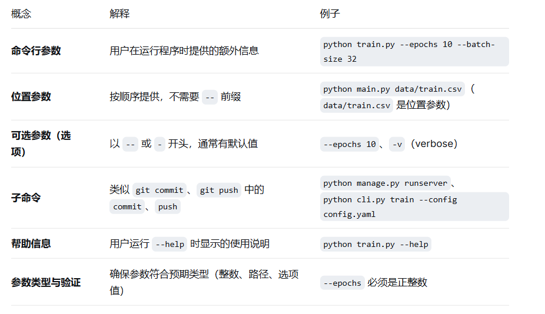

命令行入口是你的程序与用户（或自动化脚本）交互的“界面”。设计良好的 CLI 让程序易于使用、易于集成到工作流中。

# 一、核心概念：什么是命令行入口设计？



为什么需要良好的 CLI 设计？

易用性：用户不用修改代码就能改变行为

自动化：脚本可以调用你的程序，传入不同参数

可发现：--help 让用户知道所有功能

标准化：遵循 POSIX 惯例，其他开发者能快速理解

# 二、实际操作

## 技能1：用 argparse 解析基础参数。

把 argparse 想象成一个“智能分拣怪兽”。这个怪兽住在程序的入口处。每次从命令行往程序里扔东西时，它就会跳出来，把这些东西整整齐齐地分类，贴上标签，然后送给后面的代码。argparse:命令行参数解析模块。

1. 怎么召唤这个分拣怪兽？(使用argarse)
```python
import argparse
#1. 取名叫 parser。
parser = argparse.ArgumentParser(description="这是一个草莓采摘分拣机")
(注：description 是自我介绍，别人查看帮助时能看到。)
```

2. 教怪兽认东西

你必须提前告诉怪兽：“等会儿会有人扔进来几种不同的东西，你得帮我认出来。”

扔进来的东西主要有两种：

必填项（位置参数）： 必须给的东西，不给怪兽就堵着门不让走。

选填项（可选参数）： 顺便给的东西，通常前面带着减号 - 或 --。
```python
#种类一：必填的名字（字符串类型）
#只要不带减号，怪兽就知道这是必填的
parser.add_argument("name", type=str, help="草莓的品种名称")

#种类二：选填的数量（整数类型）
#带着 `--` 的是选填，我们可以指定它的类型是 int（整数）
parser.add_argument("--count", type=int, default=1, help="草莓的数量")

#种类三：开关按钮（布尔类型，True/False）
#只要写了 --ripe，就说明草莓熟了（action='store_true' 的意思就是：有它就是 True，没它就是 False）
parser.add_argument("--ripe", action="store_true", help="草莓是不是熟了")
```
3. 让怪兽开始分拣（解析参数）

教完规则后，只要下达“开始分拣”的命令，怪兽就会把分拣好的结果打包交给你，这个包裹叫 args。
```python
#.让怪兽开始干活，把分拣结果装进 args 包裹
args = parser.parse_args()

#.从包裹里拿出贴好标签的东西
print(f"🍓 收到草莓品种: {args.name}")
print(f"🔢 数量是: {args.count} 个")
print(f"☀️ 是不是熟了: {args.ripe}")
```

4. 完整说明

把上面的零件拼起来，就是一个完整的程序。我们把它存为一个叫 picker.py 的文件：
```python
Python
import argparse
#1. 召唤分拣怪兽
parser = argparse.ArgumentParser(description="草莓采摘分拣机")

#2. 规则：必须告诉我名字，可以选填数量，可选填熟没熟
parser.add_argument("name", type=str, help="草莓品种")
parser.add_argument("--count", type=int, default=1, help="数量")
parser.add_argument("--ripe", action="store_true", help="是否成熟")

#3. 闭上眼让怪兽分拣
args = parser.parse_args()

#4. 看看分拣出来的结果
print("--- 分拣报告 ---")
print(f"品种: {args.name}")
print(f"数量: {args.count}")
print(f"熟了吗: {args.ripe}")
```

5. 在黑窗口（命令行）里怎么和它玩？（怎么运行）

现在你打开命令行，运行这个 picker.py，你扔给它不同的东西，怪兽就会做出不同的反应：

玩法 A：故意什么都不给

如果你只输入 python picker.py 丢过去：

怪兽就会大喊： error: the following arguments are required: name （气死我了！必填的【品种名字】你没给我！）

玩法 B：只给必填项

输入：python picker.py 甜查理

分拣报告：

品种: 甜查理

数量: 1 (没给数量，自动用默认值 1)

熟了吗: False (没说熟不熟，默认是 False)

玩法 C：把参数全喂给它

输入：python picker.py 红颜 --count 10 --ripe

分拣报告：

品种: 红颜

数量: 10

熟了吗: True (因为写了 --ripe，开关被打开了)

玩法 D：让怪兽自己看说明书

如果你忘了怎么用，输入：python picker.py --help 或者 python picker.py -h

怪兽就会把说明书贴在你脸上：

它会清清楚楚地告诉你，哪个是必填的，哪个是选填的，甚至连你写的 help="草莓品种" 都会打印出来。


## 技能2：使用 click（更简洁，支持复杂场景）

如果说 argparse 是一个需要你手把手教规则的机器人，那么 click 就像是一个自带超能力的魔法师。你不需要写长长的规则，只需要在你的函数头顶上“戴几顶帽子”（装饰器 @），这个函数就瞬间变成了全自动的命令行工具！

安装：pip install click

1. 魔法师的代码长这样

我们把刚才那个草莓分拣机的例子，用 click 重写一遍。把它存为 picker_click.py：
```python
import click
#1. 告诉 click，下面这个函数是一个命令行命令
@click.command()

#2. 戴上第一顶帽子：必填的草莓名字（参数 Parameter）
@click.argument("name")

#3. 戴上第二顶帽子：选填的数量，默认是 1，类型是整数（选项 Option）
@click.option("--count", default=1, type=int, help="草莓的数量")

#4. 戴上第三顶帽子：熟没熟的开关（选项 Option）
#is_flag=True 的意思就是：它是个开关，后面不用传数字，写了它就是 True
@click.option("--ripe", is_flag=True, help="草莓是不是熟了")

def main(name, count, ripe):
    """这是一台高科技 Click 草莓分拣机"""
    # 5. 函数内部就是正常的 Python 代码，参数直接就能用！
    print("--- Click 分拣报告 ---")
    print(f"品种: {name}")
    print(f"数量: {count}")
    print(f"熟了吗: {ripe}")

if __name__ == '__main__':
    main()
```
2. 在命令行里怎么用？


玩法 A：不给必填项

输入：python picker_click.py

Click 提示： Error: Missing argument 'NAME'. （直接指出少了哪个参数）

玩法 B：喂饱它

输入：python picker_click.py 红颜 --count 5 --ripe

分拣报告：

品种: 红颜

数量: 5

熟了吗: True

1. Click 的超级魔法：自带彩色输出
```python
#绿色的成功提示
    click.echo(click.style("处理成功！", fg="green"))
#红色的警告提示
    click.echo(click.style("警告：发现一颗烂草莓！", fg="red", bg="yellow"))
```