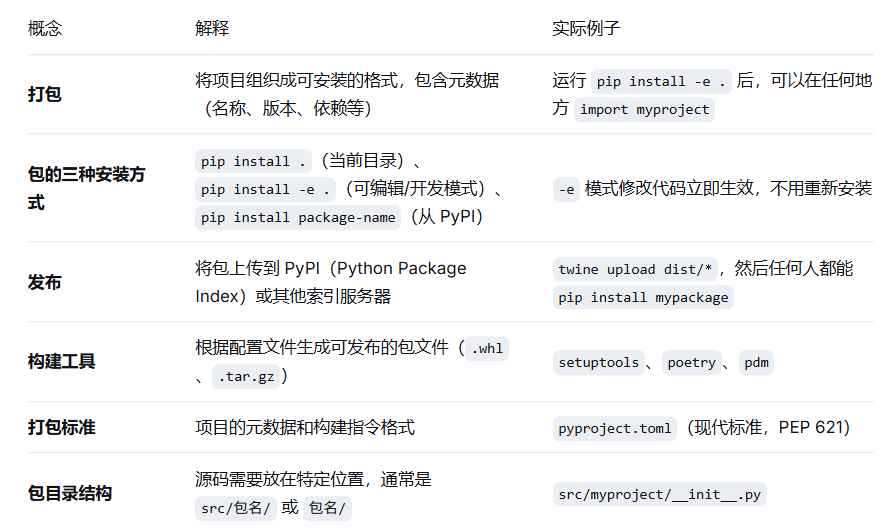
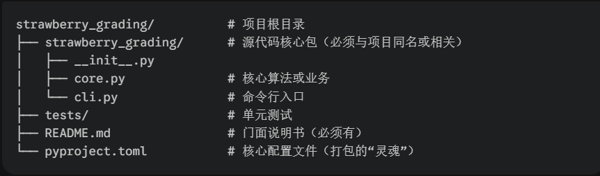
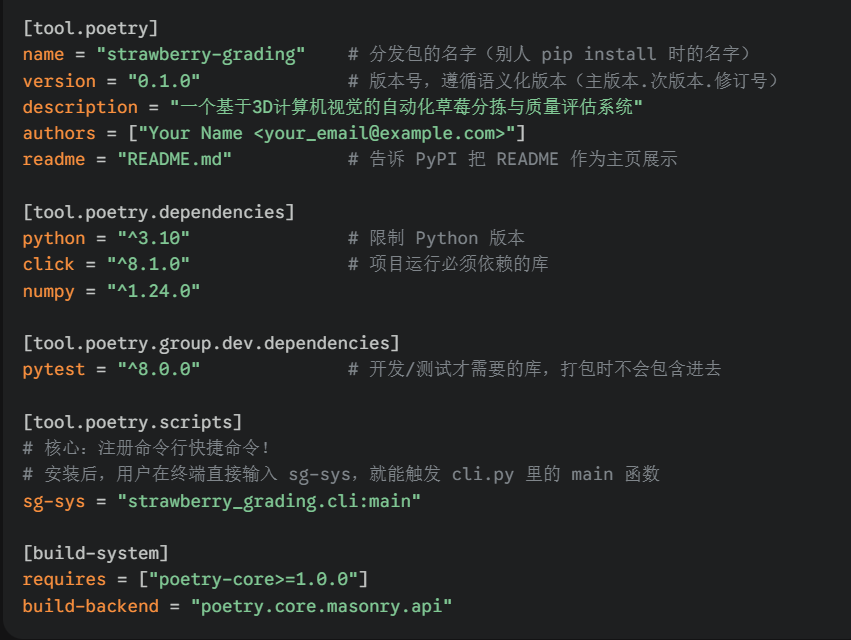

打包与发布让你的代码可以被他人轻松安装和使用——无论是同事通过 pip install -e . 安装开发版本，还是发布到 PyPI 供全世界使用。

# 一、核心概念：打包与发布是什么？



# 二、实际操作

## 技能1：创建最简可安装包（不使用外部工具）
1. 在打包之前，你的项目必须符合规范的模块化结构。一个支持打包的典型项目长这样：
```text
strawberry_grading/          # 项目根目录
├── strawberry_grading/      # 源代码核心包（必须与项目同名或相关）
│   ├── __init__.py
│   ├── core.py              # 核心算法或业务
│   └── cli.py               # 命令行入口
├── tests/                   # 单元测试
├── README.md                # 门面说明书（必须有）
└── pyproject.toml           # 核心配置文件（打包的“灵魂”）

```


1. 第一步：编写打包的“灵魂配置文件” (pyproject.toml)



3. 第二步：构建打包（把代码变成盒子）

当你的代码和说明书都准备好后，在项目根目录下执行一行命令：

poetry build

执行完后，项目下会多出一个 dist/（distribution）目录，里面包含两个文件：

strawberry_grading-0.1.0-py3-none-any.whl (Wheel 包)： 二进制分发格式，这是最重要的文件。别人安装时，pip 会直接解压这个文件，速度极快。

strawberry_grading-0.1.0.tar.gz (源码包)： 包含了原始代码的压缩包，作为 Wheel 包的后备源。

1. 第三步：发布分发（把盒子送到超市）

打包完成后，你需要把 dist/ 里面的文件推送到仓库中。

发布到开源大超市（PyPI）

如果你想把项目开源给全世界使用，你需要去 PyPI 官网 注册一个账号并申请一个 API Token（出于安全考虑，现在不推荐也不支持直接用密码上传）。
