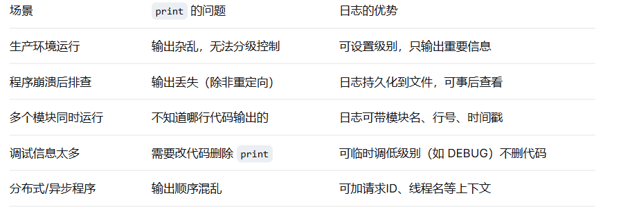
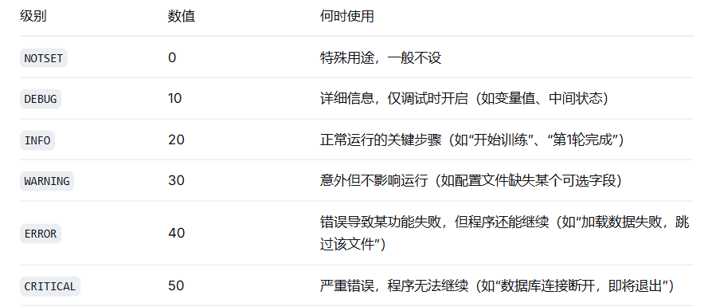
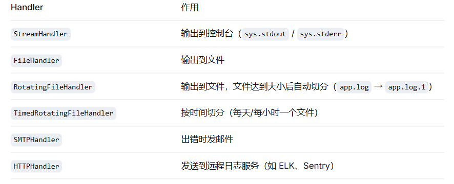
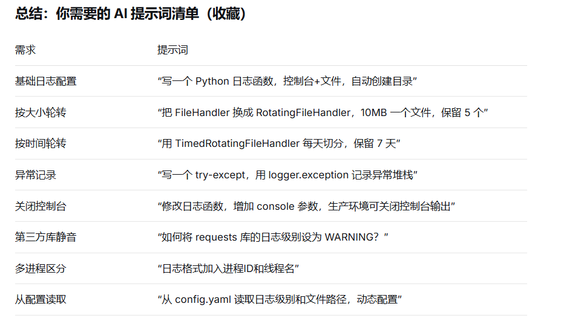

1. 为什么需要日志？（而不是 print）



1. 日志级别（Log Level）—— 从低到高

Python 的 logging 模块定义了 6 个级别（数值越大越严重）：



如果设置日志级别为 INFO，则只输出 INFO、WARNING、ERROR、CRITICAL，DEBUG 被过滤。

1. 日志处理器（Handler）—— 日志去哪里

一个 logger 可以有多个 Handler，每个 Handler 控制日志的输出目标。

常见 Handler：



开发环境：通常同时用 StreamHandler（看实时）+ FileHandler（留记录）。

生产环境：可能只用 FileHandler + RotatingFileHandler，避免控制台日志积压。

# 怎么实操？

## 场景1：给一个全新的 AI 项目快速配上日志

目标：项目启动时，控制台能看到 INFO 级别日志，同时自动写入 logs/ 目录下的文件。

操作步骤：

1.创建 utils/logger.py，让 AI 生成：

AI提示词：

写一个 Python 日志配置函数 setup_logger，要求：

- 同时输出到控制台和文件
- 控制台级别 INFO，文件级别 DEBUG（便于排查）
- 日志格式：时间 - 模块名 - 级别 - 消息
- 自动创建日志文件的目录（如 logs/）
- 返回 logger 实例

2.在 main.py 中初始化：
```python
from utils.logger import setup_logger
logger = setup_logger(__name__, log_file="logs/app.log")
logger.info("应用启动")
```

3.在其它模块中使用（无需重复 setup）：
```python
#models/trainer.py
import logging
logger = logging.getLogger(__name__)   # 直接用，会继承根 logger 的配置
logger.info("Trainer 初始化")
```

## 场景2：训练过程中每个 epoch 打印 loss，但不想被 batch 细节刷屏

需求：INFO 级别看 epoch 进度；需要调试时才看 batch 级别。

做法：

正常用 logger.info() 打印 epoch 结果

用 logger.debug() 打印每个 batch 的信息

需要调试时临时改配置文件的日志级别为 DEBUG

## 场景3：日志文件太大，需要自动切分（每天或每100MB）

目标：防止单个日志文件撑爆磁盘。

修改 utils/logger.py 中的 FileHandler：

```python
from logging.handlers import RotatingFileHandler
file_handler = RotatingFileHandler(
    log_file,
    maxBytes=10*1024*1024,   # 10MB
    backupCount=5,           # 保留5个备份文件
    encoding="utf-8"
)
或者按时间切分：
from logging.handlers import TimedRotatingFileHandler
file_handler = TimedRotatingFileHandler(
    log_file,
    when="midnight",    # 每天午夜
    interval=1,
    backupCount=7       # 保留7天
)
```

AI 提示词：

“修改下面的日志配置，把 FileHandler 换成 RotatingFileHandler，每个文件最大 20MB，保留 3 个备份”

## 场景4：不同模块设置不同日志级别（例如：第三方库的日志太吵）

问题：urllib3 或 tensorflow 打印大量 DEBUG 信息，干扰你查看自己的日志。

解决：单独设置这些 logger 的级别为 WARNING 或 ERROR。

AI 提示词：

“我在用 requests 库，它的日志太多，如何只显示 WARNING 及以上级别？给出代码”

## 场景5：生产环境关闭控制台输出，只写文件

需求：部署到服务器时，不想让日志刷屏（可能影响性能），只写入文件便于后续查看。

解决：修改 setup_logger 函数：增加一个参数 console=False。

