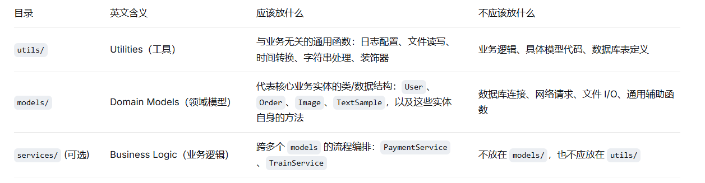
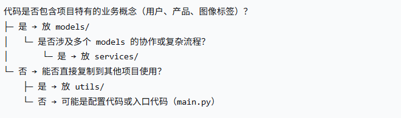
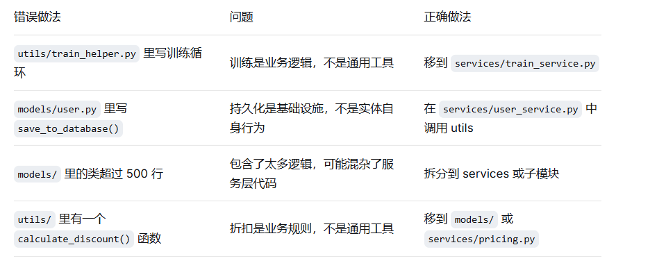

核心概念：各司其职



一句话判断：

如果你把这段代码复制到另一个完全无关的项目中，稍微改改就能用 → 放 utils/

代码直接对应你项目中的业务概念（用户、订单、图像、文档） → 放 models/

代码是“如何把用户和订单组合起来完成支付” → 放 services/



utils 里写纯函数，避免副作用

❌ 坏例子（utils 里修改全局状态）：

```python
#utils/db.py
connection = None   # 全局变量，不好
def init_db():
    global connection
    connection = create_connection()
```

✅ 好例子（显式传入依赖）：

```python
#utils/db.py
def create_connection(config):
    return connect(config)

def execute_query(connection, query):
    return connection.execute(query)
```

避免 models 和 utils 循环导入

models/email.py 需要用到 utils/text_clean.py，而 utils/text_clean.py 又想用 models/email.py 中的某个常量 → 循环导入，程序崩溃。

解决：

把常量提取到 core/constants.py 单独文件

或者把相互依赖的部分抽到 services/ 或 common/

更简单：只在 models 中导入 utils，不允许反向导入

# 原则： utils 绝对不能导入 models，services 可以导入两者，models 可以导入 utils。

常见错误与纠正


