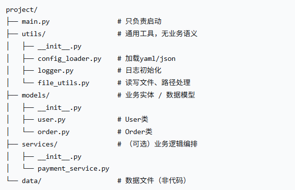
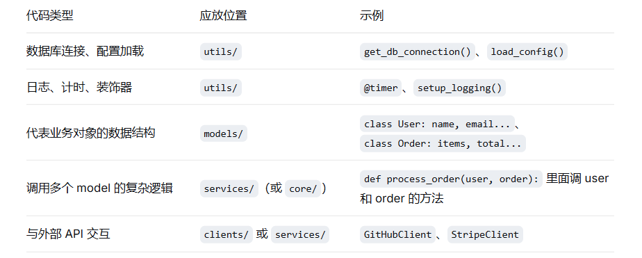
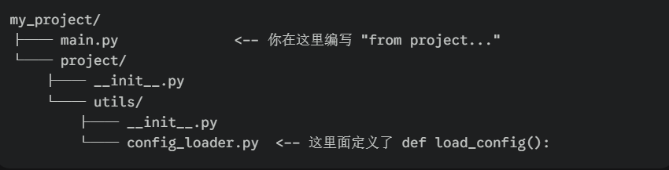

# 一、模块化拆分：如何按职责分离功能
模块化不是简单地把代码塞进不同文件夹，而是遵循单一职责原则：一个模块只做一类事情。

典型目录结构举例




如何判断代码该放哪里？


# 二、相对导入 vs 绝对导入 + PYTHONPATH

先明确概念：导入时，Python 把当前项目看作一个“包”。
包的特征：目录下有 `__init__.py`（Python 3.3+ 可省略，但仍建议显式添加）。

## 绝对导入
以项目的根目录为起点，用完整路径导入。

```python

#在 project/main.py 中

from project.utils.config_loader import load_config   # 绝对导入


结构拆解
from project.utils.config_loader: 这部分告诉 Python 去哪里找。

project: 顶层包（通常是一个文件夹）。

utils: project 下的子包或子文件夹。

config_loader: 位于 utils 文件夹中的一个 Python 文件（即 config_loader.py）。

import: 关键字，表示执行导入动作。

load_config: 具体的目标。这通常是 config_loader.py 文件中定义的一个函数、类或变量。

```




## 相对导入
相对于当前模块的位置，用 . 和 ..

```python
在 project/services/payment_service.py 中

from ..utils.config_loader import load_config   # 相对导入：上一级目录下的 utils

```

PYTHONPATH

它是一组搜索路径。如果你把你的代码放在一个奇葩的位置，又想让 Python 找到它，你就得把那个位置写进 PYTHONPATH 里。

# 三、核心入口设计：main.py 应该只做这 3 件事
main.py 是程序的总指挥，不是工人。它的任务只有三件：

解析命令行参数

加载配置文件

调用主业务函数（真正的逻辑放在其他地方）

```python

一个标准的 main.py 模板
#!/usr/bin/env python3
"""项目主入口"""
import argparse
import sys
from pathlib import Path

假设项目结构如下：
project/
├── main.py
├── utils/config_loader.py
└── services/pipeline.py

def parse_args():
    parser = argparse.ArgumentParser(description="我的项目")
    parser.add_argument("--config", default="config.yaml", help="配置文件路径")
    parser.add_argument("--mode", choices=["train", "predict"], required=True)
    return parser.parse_args()

def main():
    args = parse_args()
    
    # 加载配置
    from utils.config_loader import load_config
    config = load_config(args.config)
    
    # 调用核心业务（所有复杂逻辑都放在别处）
    from services.pipeline import run_pipeline
    run_pipeline(config, args.mode)
    
    return 0

if __name__ == "__main__":
    sys.exit(main())

```

什么绝对不能写在 main.py 里？

❌ 具体的数据处理代码（应该放 services/ 或 models/）

❌ 打开文件、写日志的细节（调用 utils）

❌ 硬编码的配置（从配置文件读取）

❌ 超过 3 层的循环或条件嵌套

